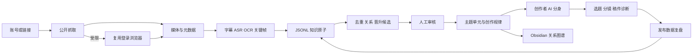

# Creator Clone Lab

[](VERSION)
[](https://github.com/renyi9044-png/creator-clone-lab/actions/workflows/ci.yml)
[](#平台支持)
[](docs/privacy-and-security.md)

**把对标账号从“看过很多遍”变成可检索、可追溯、能持续进化的创作系统。**

Creator Clone Lab 是面向内容创作者的证据驱动研究 Skill。它以抖音为核心，把视频、图文、字幕、语音、画面、评论和表现数据转成结构化知识原子，再组装为选题规律、表达方法、视觉模式、创作者 AI 分身和 Obsidian 关系图谱。

它不是只把文案抓回来，也不是读完几条视频后写一篇泛泛的“账号分析”。每条结论都要能回到来源、时间戳、画面或原文。

[30 秒安装](#30-秒安装) · [能力一览](#你最终会得到什么) · [工作流程](#完整工作流) · [平台支持](#平台支持) · [虚构示例](docs/fictional-demo.md) · [完整上手手册](docs/getting-started.md)

## 你最终会得到什么

| 你交给它 | 系统处理 | 最终产出 |
| --- | --- | --- |
| 一个抖音主页或视频链接 | 公开抓取、复用已登录浏览器、必要时请求登录 | 视频、元数据、字幕、OCR、ASR、关键帧和采集清单 |
| 一批高表现与低表现样本 | 分层、对照、寻找反例，不只总结共同点 | 选题、思考、表达、视觉和转化规律 |
| 几十到几千条素材 | 原子化、去重候选、关系候选、人工审核 | JSONL 原子库、SQLite 索引和主题单元 |
| 一个持续更新的对标账号 | 增量抓取、断点续跑、证据回链 | 可查询的创作者 AI 分身 |
| 新选题或脚本需求 | 先检索证据，再调用规则组装 | 带依据的选题、分镜脚本和稿件诊断 |
| 发布后的真实数据 | 对比预测与实绩，定位失败环节 | T+1h/T+24h 复盘和规则置信度更新建议 |

## 独有能力

### 1. 无字幕视频也能研究

先读取平台字幕；没有字幕时调用本地 `faster-whisper`，本地不可用时可选 Groq Whisper API。画面文字走 OCR，动作、场景和镜头变化进入视觉证据，避免把“没有字幕”误判为“没有内容”。

### 2. 抓取失败不会直接停下

每个平台统一执行以下降级链：

```text
公开免登录抓取
→ 尝试用户已经登录的浏览器
→ 仅在确实需要时请用户登录或验证
→ 截图 / OCR / 手工证据兜底
```

### 3. 数千条知识原子，不是一个超长总结

原始证据以 JSONL 原子保存，稳定规律再晋升为 `QST/CON/OPI/CAS/SOL` 内容单元或 `HOK/STR/EXP/VIS/CTA` 创作模式。原子、单元、主题和脚本之间保留来源关系。

### 4. 图谱中的每个节点都能点开

系统生成真正的 Obsidian Vault：来源、知识原子、创作规律、主题地图和组装稿都是独立 Markdown 节点，并通过 `[[wikilinks]]` 连接。图谱密度来自真实证据，不靠虚构节点撑场面。

### 5. AI 分身会说“证据不足”

规则必须记录支持样本、反例、表现区间、适用格式、失败边界和置信度。样本不足时只允许生成临时判断，不能把个人感觉包装成创作者规律。

### 6. 可以持续更新，而不是一次性报告

处理队列支持 `pending / in_progress / completed / failed / blocked`，可断点续跑。新增作品只处理增量，发布数据会进入复盘链路，旧证据不会被新结果偷偷改写。

## 30 秒安装

已通过 `skills` CLI 验证，仓库可以被正确识别为一个 Skill：

```bash
npx -y skills add renyi9044-png/creator-clone-lab -g --all
```

安装后重新打开 Codex，直接说：

```text
用 creator-clone-lab 初始化一个抖音对标研究项目
```

首次使用会检查 `yt-dlp`、FFmpeg、语音转文字、OCR、图谱渲染和 SQLite FTS5。需要的能力缺失时，Skill 会安装依赖或明确告诉你缺什么。

手动安装和 Windows 环境说明见[新手上手手册](docs/getting-started.md)。

## 完整工作流



详细的数据分层、证据规则和增量更新机制见[系统架构](docs/architecture.md)。

## 常见用法

```text
抓取这个抖音账号最近 30 条作品，先检查公开抓取，不行再复用我已登录的浏览器。
```

```text
把高表现和低表现样本分开蒸馏，提炼他怎么选题、怎么判断、怎么表达，不要只总结口头禅。
```

```text
把这批内容建成 Obsidian 知识库，让每个原子、来源、主题和规律都能在图谱里点开。
```

```text
先检索这个博主已有证据，再按他的判断方式给我生成 5 个新选题；每条说明调用了什么规则。
```

```text
这是作品发布 24 小时的数据，复盘是选题、开头、视觉证明、节奏还是受众匹配出了问题。
```

## 平台支持

| 平台 | 定位 | 当前能力 |
| --- | --- | --- |
| 抖音 | **核心平台** | 短链/主页/单条研究、公开抓取、登录浏览器复用、媒体理解、ASR/OCR、知识化 |
| 小红书 | 扩展适配 | 公开主页提取、登录浏览器视频捕获、图文与视频理解 |
| B 站 | 扩展适配 | 视频信息、互动指标、DASH 媒体和字幕/语音处理 |
| 快手 | 兼容路径 | 公开抓取、浏览器复用和通用媒体理解 |
| 微信公众号 | 兼容路径 | 文章正文、图片、作者、时间和可见指标归档 |
| 网页/本地文件 | 通用入口 | 文本、图片、音视频和已有导出文件导入 |

抖音是主链路；其他平台是为了补充跨平台样本，不会反过来削弱抖音研究流程。具体边界见[平台支持与降级策略](docs/platform-support.md)。

## 知识库产物

初始化后，每个创作者或研究范围拥有独立项目：

```text
project/
├── 01_sources/          # 不可变来源副本与媒体
├── 02_normalized/       # 字幕、OCR、正文等标准化文档
├── 03_atom_store/       # 可扩展到数千条的 JSONL 原子库
├── 04_content_units/    # 问题、概念、观点、案例、方案
├── 05_creator_patterns/ # 开头、结构、表达、视觉、转化规律
├── 06_topic_maps/       # 主题图谱
├── 07_creator_clone/    # 创作者 AI 分身
├── 08_creations/        # 证据驱动的选题和脚本组装稿
├── 10_state/            # 队列、候选、审核决定和增量状态
├── 11_reports/          # 发布表现与复盘
└── 内容资产工程/        # 可直接用 Obsidian 打开的关系图谱
```

查看一套不含任何真实账号信息的完整产出示例：[虚构项目演示](docs/fictional-demo.md)。

## 质量门槛

- `1-9` 条完整样本：只能做快速分析。
- `10-29` 条：允许建立临时 AI 分身。
- `30+` 条且覆盖高、低表现：才进入稳定候选。
- 稳定分身还必须有反例、来源回链和至少一次发布复盘。

这些数字不是“看够数量就自动正确”。如果账号同时做口播、剧情和图文，必须分格式研究。

## 数据与隐私

仓库只包含 Skill、脚本、空模板和虚构测试样本，不包含作者账号数据、抓取结果、Cookie、登录状态、API Key、浏览器资料或个人知识库。

- 用户数据默认留在用户指定的本地项目目录。
- 登录信息不会写入 `capture_manifest.json`。
- `.gitignore` 阻止常见项目目录、媒体、数据库、Cookie 和环境变量被误提交。
- CI 会执行发布隐私检查，扫描敏感路径和高风险密钥格式。

完整规则见[隐私与安全](docs/privacy-and-security.md)。

## 仓库结构

```text
creator-clone-lab/
├── creator-clone-lab/   # 可安装 Skill
│   ├── SKILL.md
│   ├── scripts/          # 37 个确定性工具
│   ├── references/       # 平台、知识、蒸馏和原子规范
│   ├── templates/        # 空模板与虚构样例
│   └── tests/            # 端到端工作流测试
├── docs/                 # 用户手册、架构和示例
├── tools/                # 发布与隐私验证
└── .github/workflows/    # 自动测试
```

## 文档

- [新手上手手册](docs/getting-started.md)
- [系统架构与证据模型](docs/architecture.md)
- [平台支持与降级策略](docs/platform-support.md)
- [虚构项目演示](docs/fictional-demo.md)
- [隐私与安全](docs/privacy-and-security.md)

## 当前版本

`v1.0.0`：首个公开稳定版，包含数千条 JSONL 原子存储、人工审核候选、断点续跑、增量 Obsidian Vault、精确证据回链和关系图谱验证。

版本发布与升级记录见 [GitHub Releases](https://github.com/renyi9044-png/creator-clone-lab/releases)。
