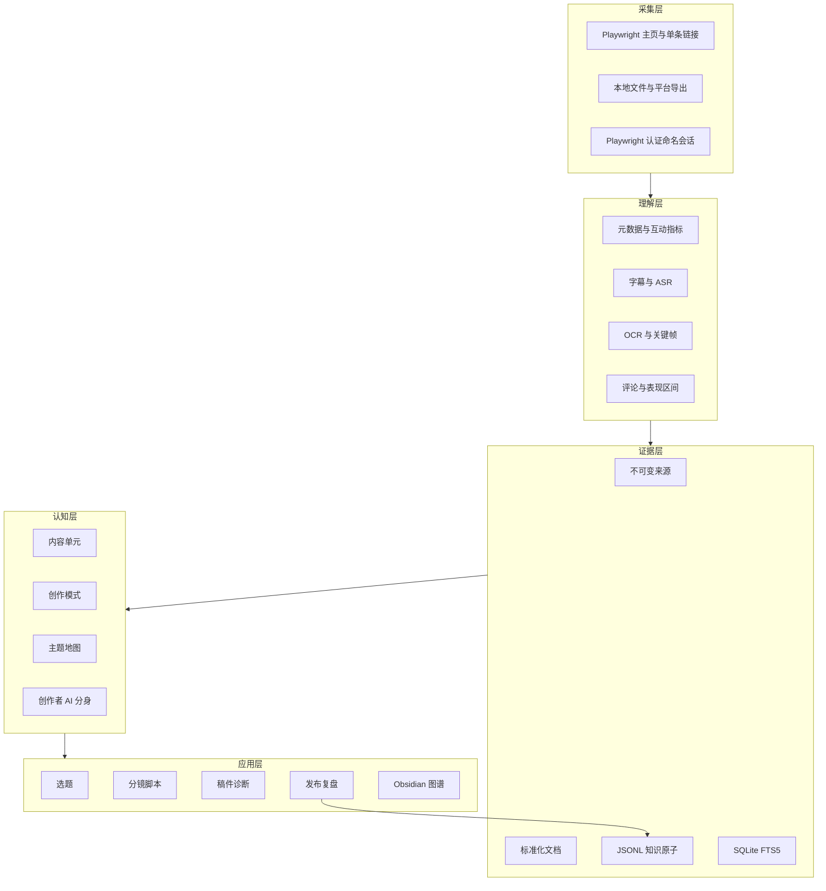
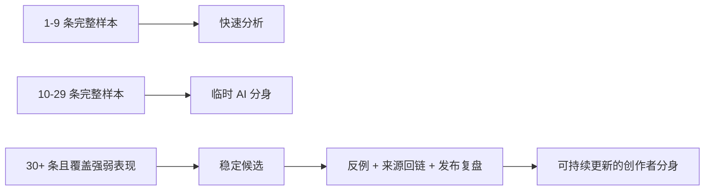

# 系统架构与证据模型

## 设计目标

Creator Clone Lab 的目标不是生成一份静态账号报告，而是建立一个能持续接收新证据、保留冲突、支持检索和参与创作的本地系统。

## 五层架构



## 为什么同时使用 JSONL、Markdown 和 SQLite

| 存储 | 负责什么 | 不负责什么 |
| --- | --- | --- |
| JSONL | 保存数千条紧凑、可迁移的证据原子 | 不承担人工阅读体验 |
| Markdown | 保存审核后的稳定知识单元和人工笔记 | 不承担海量原子的主存储 |
| SQLite | 全文检索、关系和状态查询 | 不是唯一真相来源 |
| Obsidian Vault | 把来源、原子、单元、主题和组装稿变成可点击产品 | 不替代规范化后端 |

## 原子与晋升单元

原始原子至少包含：

```json
{
  "id": "ATM-DEMO-001",
  "knowledge": "视频开头先展示可见结果",
  "original": "成品界面在流程解释前出现",
  "source_id": "DY-DEMO-001",
  "source_locator": "00:00-00:04",
  "topics": ["结果前置"],
  "type": "observation",
  "confidence": "medium",
  "status": "hypothesis"
}
```

当一个判断被重复证据支持、与其他知识有稳定关系或对创作有长期价值时，才晋升为单元。

内容单元：

```text
QST 受众问题
CON 概念
OPI 观点
CAS 案例或证明
SOL 解决方案
```

创作模式：

```text
HOK 开头
STR 结构
EXP 表达
VIS 视觉
CTA 结尾与转化
```

## 候选不等于事实

系统可以自动提出：

- 原始原子重复候选。
- 已晋升单元重复候选。
- 多来源原子的晋升候选。
- 带类型的关系候选。

这些候选进入统一审核队列。接受关系会写入类型边；接受晋升会创建稳定单元；接受重复只确认相似，不会破坏性合并来源。

## 精确证据回链

证据优先通过“来源 ID + 时间戳/段落位置”匹配原子，再使用原文摘录辅助。无法唯一匹配时保持未链接，不能为了图谱完整把证据随便挂到第一个原子上。

## 增量与人工编辑保护

Obsidian Vault 使用生成文件哈希管理增量更新：

- 未变化文件不重写。
- 被人工修改的生成节点在覆盖前备份。
- `08-人工笔记` 永不覆盖。
- 旧版 Vault 第一次升级前创建完整快照。
- Obsidian 工作区和图谱设置会被保留。

## 成熟度门槛



门槛用于阻止过度结论，不代表数量本身能替代样本质量。
