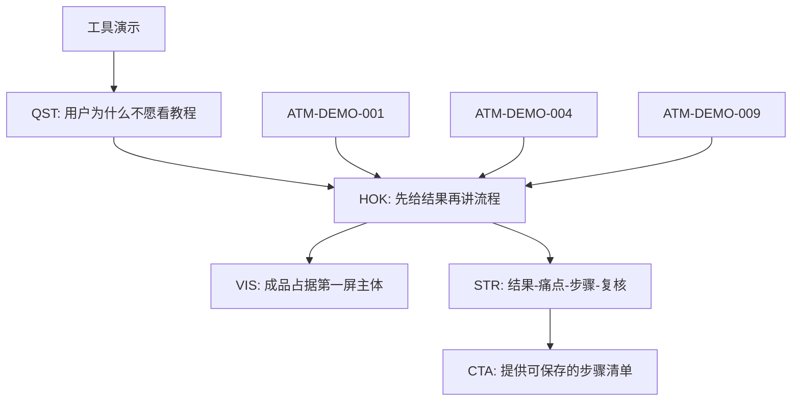

# 虚构项目演示

以下内容全部为虚构数据，只用于展示 Creator Clone Lab 的产物结构，不对应任何真实账号、视频或用户。

## 输入

虚构账号“效率实验室”有 12 条工具演示视频：

- 4 条高收藏作品。
- 4 条普通表现作品。
- 4 条低完播作品。
- 部分视频没有平台字幕。

系统为每条作品采集标题、时间、指标、ASR、OCR 和关键帧描述，并生成独立来源 ID。

## 一条知识原子

```json
{
  "id": "ATM-DEMO-001",
  "knowledge": "高收藏样本先展示可见结果，再解释操作步骤",
  "original": "00:00 出现整理后的知识库页面，00:05 开始演示导入",
  "source_id": "DY-DEMO-001",
  "source_locator": "00:00-00:05",
  "topics": ["工具演示", "结果前置"],
  "type": "observation",
  "confidence": "medium",
  "status": "hypothesis",
  "unit_ids": []
}
```

## 从原子晋升为规律

当 3 条独立高收藏样本重复出现相同结构，同时低完播样本缺少可见结果时，系统提出晋升候选：

```text
ID: HOK-DEMO-001
类型: HOK
标题: 先给结果，再讲流程
判断: 工具型短视频在开头 5 秒展示可检查的成品，比先介绍背景更容易建立观看理由。
状态: pattern
置信度: medium
支持来源: DY-DEMO-001, DY-DEMO-004, DY-DEMO-009
反例: DY-DEMO-006 的结果前置明显，但画面过小，完播仍然偏低。
边界: 适用于有明确前后对比的工具演示；不直接迁移到观点口播。
```

## 主题地图



## AI 分身规则

```text
当用户提出一个工具教程选题时：
1. 先确认有没有可见、可检查的最终结果。
2. 没有结果画面时拒绝直接套用“结果前置”。
3. 有结果时，把成品放进第一拍主体区域。
4. 第二拍再交代用户原来的耗时或混乱。
5. 步骤必须能在结尾被复核，不能只展示操作过程。
```

## 用分身生成的新脚本

```text
选题：把 200 篇文章变成可搜索的选题库

00:00-00:03
画面：直接搜索“用户为什么不下单”，展示知识库返回 6 条带来源结果。
字幕：200 篇文章，3 秒找到能拍的选题。
目的：调用 HOK-DEMO-001 和 VIS-DEMO-001，先证明结果存在。

00:03-00:08
画面：切回散落的网页、文档和收藏夹。
字幕：以前不是没内容，是根本找不到。
目的：建立结果前后的可见差距。

00:08-00:22
画面：导入、语音转文字、知识原子和主题图谱依次出现。
字幕：抓取只是第一步，真正有用的是让每条结论都能回到原文。
目的：按 STR-DEMO-002 展开机制，不堆功能名。

00:22-00:28
画面：再次搜索并点开来源时间戳。
字幕：能查到，能点回去，才算你的内容资产。
目的：复核开头承诺。
```

## 发布后更新

如果新视频播放一般但收藏率高，系统不会简单宣布“规则失效”，而是区分：

- 开头是否建立点击后的观看理由。
- 结果画面是否足够清晰。
- 内容是否更适合搜索与收藏，而非大范围推荐。
- 分发不足和结构失败是否被混为一谈。

复盘结果作为新证据写入，不覆盖旧样本。
